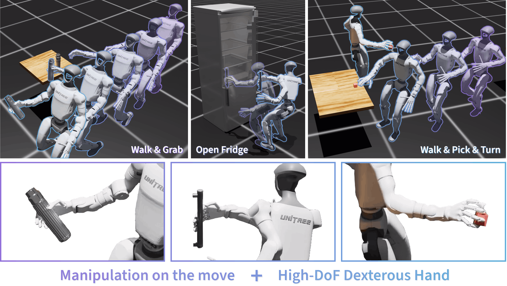

<div align="center">

# CoorDex: Coordinating Body and Hand Priors for Continuous Dexterous Humanoid Loco-Manipulation

**Sikai Li**<sup>1</sup>, **Shuning Li**<sup>1</sup>, **Zhenyu Wei**<sup>1</sup>, **Yunchao Yao**<sup>1</sup>, **Chenran Li**<sup>2</sup>, **Mingyu Ding**<sup>1</sup>

<sup>1</sup>University of North Carolina at Chapel Hill&emsp;<sup>2</sup>University of California, Berkeley

[](https://docs.isaacsim.omniverse.nvidia.com/5.0.0/index.html)
[](https://isaac-sim.github.io/IsaacLab/v2.2.0/index.html)
[](https://docs.python.org/3/whatsnew/3.11.html)

[](https://skevinci.github.io/coordex/)
[](https://skevinci.github.io/coordex/)

</div>



## Overview
The codebase supports:

- G1 Wuji loco-manipulation rollout for WalkGrab, OpenFridge, and WalkPickTurn.
- Frozen body/hand priors plus trained coord-residual policy checkpoints.

## Table of Contents

- [CoorDex: Coordinating Body and Hand Priors for Continuous Dexterous Humanoid Loco-Manipulation](#coordex-coordinating-body-and-hand-priors-for-continuous-dexterous-humanoid-loco-manipulation)
  - [Overview](#overview)
  - [Table of Contents](#table-of-contents)
  - [Prerequisites](#prerequisites)
  - [Installation](#installation)
    - [1. Create conda environment](#1-create-conda-environment)
    - [2. Install Isaac Sim 5.0](#2-install-isaac-sim-50)
    - [3. Install Isaac Lab 2.2.0](#3-install-isaac-lab-220)
    - [4. Install this package](#4-install-this-package)
  - [Usage](#usage)
    - [Locomanip Rollout](#locomanip-rollout)
  - [Project Structure](#project-structure)
  - [Contact](#contact)

## Prerequisites
- [Isaac Sim 5.0](https://docs.omniverse.nvidia.com/isaacsim/latest/installation/install_workstation.html)
- [Isaac Lab 2.2.0](https://isaac-sim.github.io/IsaacLab/)
- Conda

## Installation
### 1. Create conda environment
```bash
conda create -n coordex python=3.11 -y
conda activate coordex
```

### 2. Install Isaac Sim 5.0
```bash
pip install torch==2.7.0 torchvision==0.22.0 --index-url https://download.pytorch.org/whl/cu128
pip install "isaacsim[all,extscache]==5.0.0" --extra-index-url https://pypi.nvidia.com
```

### 3. Install Isaac Lab 2.2.0
```bash
sudo apt install cmake build-essential

# Clone Isaac Lab
git clone git@github.com:isaac-sim/IsaacLab.git

cd IsaacLab
git checkout v2.2.0
./isaaclab.sh --install
```


### 4. Install this package
```bash
# Clone this repository separately from the Isaac Lab installation
git clone git@github.com:Skevinci/CoorDex.git

cd CoorDex
python -m pip install -e source/coordex
```

## Usage
### Locomanip Rollout

Three public Gym task IDs are registered:

- `CoorDex-WalkGrab-Wuji-v0`
- `CoorDex-Fridge-Wuji-v0`
- `CoorDex-WalkPickTurn-Wuji-v0`

The rollout script selects the matching policy, body prior, and hand prior checkpoint from `ckpts/` by default:

```bash
./isaaclab.sh -p /path/to/CoorDex/scripts/rsl_rl/play_locomanip.py \
  --task CoorDex-WalkGrab-Wuji-v0 \
  --headless --num_envs 1
```

Checkpoint overrides are available when needed:

```bash
./isaaclab.sh -p /path/to/CoorDex/scripts/rsl_rl/play_locomanip.py \
  --task CoorDex-WalkPickTurn-Wuji-v0 \
  --checkpoint /path/to/policy.pt \
  --body-prior-checkpoint /path/to/body_prior.pt \
  --hand-prior-checkpoint /path/to/hand_prior.pt
```

## Project Structure

```bash
CoorDex
├── assets  # Figures and media used by the README/project page
├── ckpts  # Released rollout checkpoints and frozen prior checkpoints
│   ├── body_prior  # Body prior VAE checkpoints
│   ├── hand_prior  # Wuji hand prior VAE checkpoints
│   └── locomanip  # Coord-residual policy checkpoints for the three tasks
├── config  # Isaac Lab extension metadata
├── scripts
│   └── rsl_rl
│       └── play_locomanip.py  # Roll out WalkGrab, Fridge, and WalkPickTurn policies
└── source
    └── coordex
        ├── setup.py  # Python package entry point
        ├── pyproject.toml  # Package build metadata
        └── coordex
            ├── assets  # USD assets for G1 Wuji, fridge, and condiment object
            ├── distillation  # Minimal VAE modules used by the frozen priors
            ├── policies  # Coord-residual actor-critic used for checkpoint loading
            ├── robots  # G1 Wuji robot configuration
            └── tasks
                └── locomanip
                    ├── walkgrab_env_cfg.py  # WalkGrab environment config
                    ├── fridge_env_cfg.py  # Fridge environment config
                    ├── walkpickturn_env_cfg.py  # WalkPickTurn environment config
                    ├── config/g1_wuji  # RSL-RL runner and agent config
                    └── mdp  # Actions, commands, observations, rewards, events, and terminations
```

## Contact
If you have any questions, feel free to contact me through email ([sikaili@cs.unc.edu](mailto:sikaili@cs.unc.edu)).
